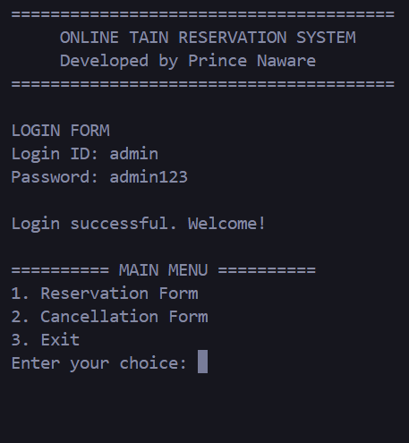
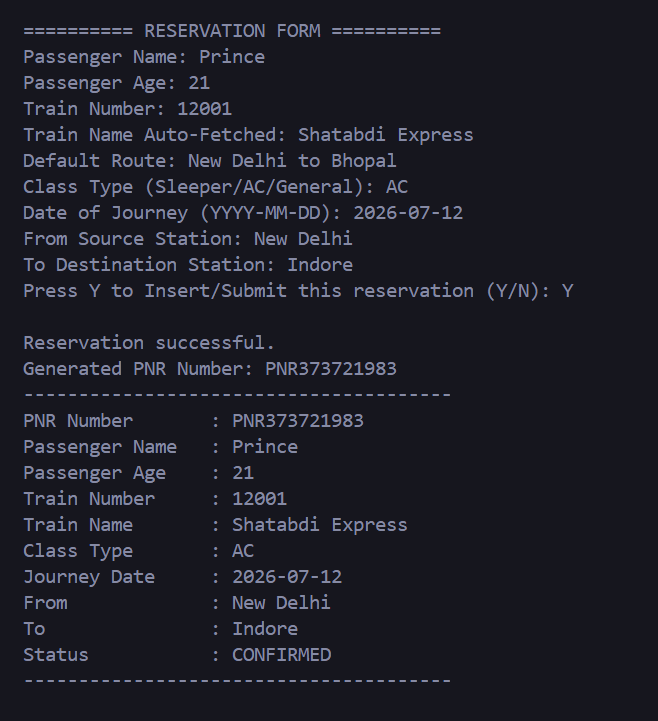
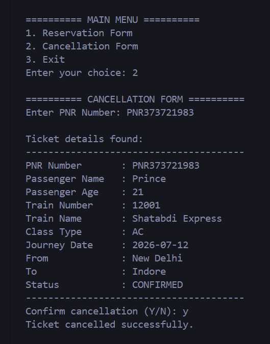

# 🚆 Online Railway Reservation System


A **console-based Online Railway Reservation System** developed using **Java, JDBC, and MySQL** as part of the **Oasis Infobyte Java Development Internship**.

The application provides a complete railway reservation workflow including secure user authentication, train lookup, ticket booking, PNR generation, booking management, and ticket cancellation. The system follows a layered architecture to ensure maintainability, scalability, and separation of concerns.


---

# 📌 Project Overview

The Online Railway Reservation System is a menu-driven Java console application that automates the railway reservation process.

The application allows authenticated users to:

- Log in securely
- Search trains
- Book tickets
- Generate unique PNR numbers
- View booking details
- Cancel reservations
- Store records permanently in a MySQL database

The project demonstrates the practical implementation of Core Java, JDBC connectivity, database operations, authentication mechanisms, and layered software architecture.

---

# 🎯 Objectives

The primary objectives of this project are:

- Automate railway ticket booking and cancellation
- Implement secure user authentication
- Generate unique PNR numbers for every reservation
- Store booking records permanently in MySQL
- Demonstrate JDBC-based database connectivity
- Apply layered software architecture principles
- Improve user experience through menu-driven navigation

---

# ❓ Problem Statement

Traditional reservation systems can be inefficient when handled manually and often result in data redundancy, delays, and errors.

This project aims to provide a reliable and efficient railway reservation solution that enables users to perform reservation-related operations through a simple console interface while maintaining data integrity and security through database persistence.

---

# ✨ Features

## 🔐 Secure Login System

- User authentication using Login ID and Password
- Password hashing using SHA-256
- Secure credential verification

## 🚆 Train Search

- Search trains using train numbers
- Retrieve train details from MySQL database

## 🎫 Ticket Reservation

- Enter passenger details
- Select train and journey date
- Generate reservation records

## 🔢 Automatic PNR Generation

- Unique PNR assigned for every reservation
- Randomized and collision-safe generation logic

## ❌ Ticket Cancellation

- Cancel tickets using PNR number
- Booking status updated automatically

## 📂 Booking Management

- Reservation data stored permanently
- Booking records maintained in database

## ✔ Input Validation

- Numeric validation
- String validation
- Date validation
- User confirmation checks

## 🗄 Database Integration

- MySQL-based persistent storage
- JDBC-based database operations

---

# 🏗 System Architecture

```text
+----------------------+
|      Console UI      |
+----------------------+
           |
           v
+----------------------+
|    Service Layer     |
|----------------------|
| AuthService          |
| ReservationService   |
| CancellationService  |
+----------------------+
           |
           v
+----------------------+
|      DAO Layer       |
|----------------------|
| UserDAO              |
| TrainDAO             |
| BookingDAO           |
+----------------------+
           |
           v
+----------------------+
|    MySQL Database    |
+----------------------+
```

# 🔄 Project Workflow

```text
START
  |
  v
User Login
  |
  v
Authentication
  |
  +---- Invalid Credentials
  |            |
  |            v
  |         Exit
  |
  +---- Success
             |
             v
        Main Menu
             |
     +-------+-------+
     |               |
     v               v
Book Ticket    Cancel Ticket
     |               |
     v               v
Train Search    Enter PNR
     |               |
     v               v
Passenger Info  Confirm Cancel
     |               |
     v               v
Generate PNR    Update Status
     |               |
     +-------+-------+
             |
             v
            END
```

# 🗄 Database Design

## Users Table

```text
+----------------------+
|       USERS          |
+----------------------+
| user_id              |
| login_id             |
| password_hash        |
| full_name            |
+----------------------+
```

## Trains Table

```text
+----------------------+
|       TRAINS         |
+----------------------+
| train_no             |
| train_name           |
| source               |
| destination          |
+----------------------+
```

## Bookings Table

```text
+----------------------+
|      BOOKINGS        |
+----------------------+
| booking_id           |
| pnr_number           |
| passenger_name       |
| train_no             |
| journey_date         |
| status               |
+----------------------+
```

# 🛠 Technologies Used

| Technology | Purpose |
|------------|----------|
| Java | Core Development |
| JDBC | Database Connectivity |
| MySQL | Data Storage |
| SQL | Database Queries |
| VS Code / IntelliJ | Development Environment |
| Git & GitHub | Version Control |


# 📚 Java Concepts Implemented

- Classes and Objects
- Encapsulation
- Packages
- JDBC Connectivity
- Exception Handling
- Collections
- Loops
- Conditional Statements
- Input Validation
- Layered Architecture
- DAO Design Pattern
- Secure Password Hashing
- Database CRUD Operations

# ⚙ Installation & Setup

### 1. Clone Repository

```bash
git clone <repository-url>
```

### 2. Create Database

Run:

```sql
database/online_reservation.sql
```

in MySQL Workbench.

### 3. Configure Database

Update:

```java
DatabaseConfig.java
```

with your database credentials.

### 4. Run Application

Execute:

```bash
Main.java
```

# ▶ Sample Workflow

1. Login with valid credentials.
2. Choose Reservation option.
3. Enter Train Number.
4. Fill Passenger Details.
5. Generate Reservation.
6. Receive PNR Number.
7. Cancel reservation using PNR if required.

# 📸 Screenshots

## Login Screen



## Reservation Form



## Ticket Cancellation



# 🎯 Learning Outcomes

Through this project, the following skills were developed:

- Java Application Development
- JDBC Integration
- Database Management
- Authentication Systems
- Software Architecture Design
- DAO Pattern Implementation
- Secure Coding Practices
- Input Validation
- Exception Handling
- Problem Solving

# 🚀 Future Enhancements

- Seat Availability Management
- Fare Calculation Module
- Waitlist Functionality
- Admin Dashboard
- Java Swing GUI
- JavaFX Desktop Application
- PDF Ticket Generation
- Email Notifications
- Online Payment Gateway
- Multi-User Role Management

# 👨‍💻 Author

**Prince Naware**


---

⭐ If you found this project useful, consider giving it a star on GitHub!